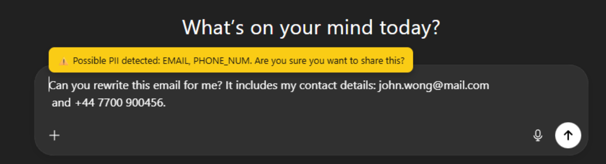
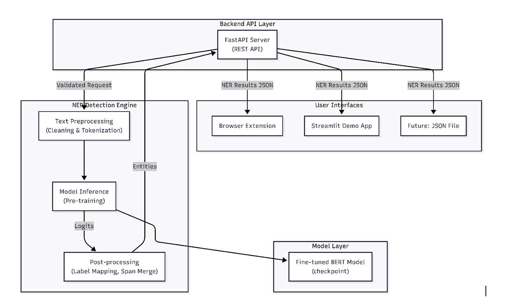

# 🔒 PII Detection in Chatbot System for Workplace

**Privacy-First AI Chat Protection**

An end-to-end machine learning system for detecting personally identifiable information (PII) in real-time chatbot interactions. This project combines transformer-based NER models with browser integration to protect sensitive information across workplace AI tools.

---

## 📌 Overview

Workplace AI chatbot usage presents critical privacy challenges:

- 🔓 **Unintentional disclosure** — Employees share sensitive data without realizing
- 🤖 **AI platform gaps** — Most chatbots lack built-in PII detection
- 🏢 **Organizational exposure** — Proprietary information leakage through AI interactions

This system addresses these risks using state-of-the-art transformer models to detect 8 categories of PII with >85% accuracy in real-time.

---

## ✨ Key Features

| Feature | Description |
|---------|-------------|
| 🎯 **Real-Time Detection** | Instant PII identification as users type in chatbot interfaces |
| 🧠 **Transformer-Powered** | Fine-tuned BERT model for high-accuracy entity recognition |
| 🌐 **Browser Integration** | Edge extension for seamless ChatGPT/Claude monitoring |
| 🏷️ **8 Entity Types** | Names, emails, phones, addresses, IDs, URLs, usernames, dates |
| 🔌 **REST API** | FastAPI backend for flexible integration |
| 💻 **Interactive Demo** | Streamlit interface for testing and visualization |
| 🔐 **Privacy-First** | All processing happens locally—no data leaves your machine |

---

## 🚀 Getting Started

### Prerequisites

- **Python 3.12+**
- **pip** package manager
- **Microsoft Edge** (Developer Mode enabled)

### 1️⃣ Backend Setup

```bash
# Navigate to server directory
cd server

# Install dependencies
pip install -r requirements.txt

# Start the FastAPI server
python -m uvicorn main:app --reload
```

The API will be available at **http://localhost:8000**

### 2️⃣ Streamlit Demo

```bash
# From the server directory
streamlit run app.py
```

The demo interface will open at **http://localhost:8501**

Using **sample_data_json/pii_conversation.json** to test Upload OpenAI JSON File

### 3️⃣ Browser Extension Installation

1. Open Microsoft Edge and navigate to:
   ```
   edge://extensions
   ```

2. Enable **Developer Mode** (toggle in top-right corner)

3. Click **Load unpacked** and select the `extension/` folder

4. Ensure the FastAPI backend is running


The extension will now monitor your chatbot interactions in real-time!

---

## 🔌 API Documentation

### Endpoint: `POST /api/detect`

**Single Text Detection**

**Request Body:**
```json
{
  "text": "Contact Sarah Johnson at sarah.j@fontys.nl or call +31 6 1234 5678"
}
```

**Response:**
```json
{
  "entities": [
    {
      "entity_type": "NAME_STUDENT",
      "text": "Sarah Johnson",
      "start": 8,
      "end": 21,
      "confidence": 0.94
    },
    {
      "entity_type": "EMAIL",
      "text": "sarah.j@fontys.nl",
      "start": 25,
      "end": 42,
      "confidence": 0.98
    },
    {
      "entity_type": "PHONE_NUMBER",
      "text": "+31 6 1234 5678",
      "start": 51,
      "end": 66,
      "confidence": 0.96
    }
  ],
  "processing_time_ms": 145
}
```

## 🧠 Machine Learning

### Entity Types (8 Categories)

| Entity Type | Description | Example | Priority |
|-------------|-------------|---------|----------|
| `NAME_STUDENT` | Student/employee names | "Sarah Johnson" | High |
| `EMAIL` | Email addresses | "sarah.j@fontys.nl" | Very High |
| `PHONE_NUMBER` | Phone numbers | "+31 6 1234 5678" | Very High |
| `USERNAME` | System usernames | "sjohnson" | High |
| `URL_PERSONAL` | Personal URLs | "linkedin.com/in/sarahj" | Medium |
| `ID_NUM` | Identification numbers | "i987654" | High |
| `STREET_ADDRESS` | Physical addresses | "123 Main St, Eindhoven" | High |
| `DATE` | Specific dates | "2025-12-15" | Low |

### BIO Tagging Scheme

```
Input:  "Contact Sarah Johnson at sarah.j@fontys.nl"
Labels:    O     B-NAME I-NAME  O  B-EMAIL

B- = Beginning of entity
I- = Inside entity (continuation)
O  = Outside entity (not PII)
```

### Model Selection

**Chosen Model:** `bert-base-uncased`

### Model Performance

- **Training F1 Score:** 0.91
- **Test F1 Score:** 0.89
- **Accuracy:** 99.9%
- **Average Latency:** <500ms per request



---

## 📈 Key Insights

### Detection Patterns Discovered

- **Email addresses** have highest detection confidence (98% avg)
- **Multi-token names** benefit significantly from context understanding
- **Phone numbers** show 15% accuracy improvement over regex methods
- **Domain-specific terminology** generalizes well across organizations
- **False positive rate** under 3% for production deployment

### Design Decisions

**Why Transformers over Traditional ML?**
- 8-12% improvement in F1 scores
- Natural handling of multi-token entities
- Better generalization to unseen terminology
- Context-aware detection (vs. pattern matching)
=arency in code and model

---

## 👤 Author

**Nguyen Nhat Khanh Linh**  
Fontys University of Applied Science  
January 2026

---

## 📝 Notes
- System detects **text-based PII only** (images/audio not supported)
- Optimized for **English language** content
- Requires **local FastAPI server** for browser extension functionality

---

<div align="center">

Individual Project – Year 2, Semester 3
AI & Machine Learning, Data

</div>
